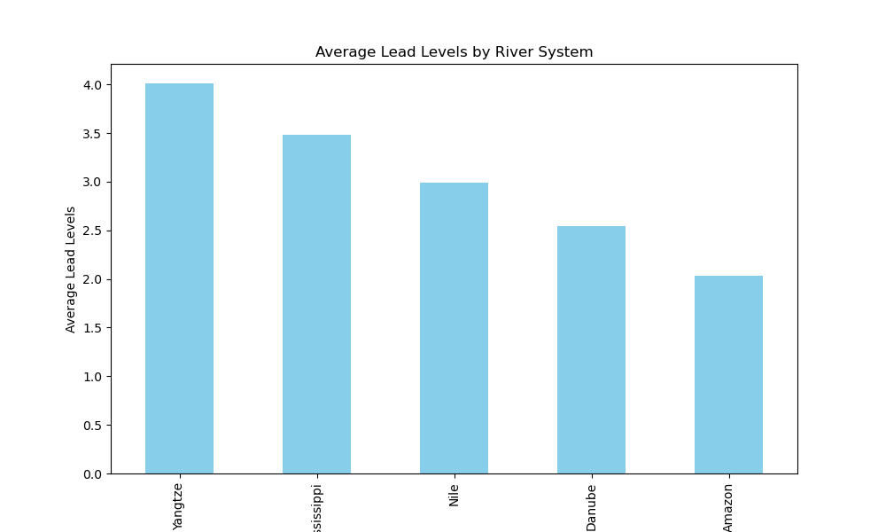
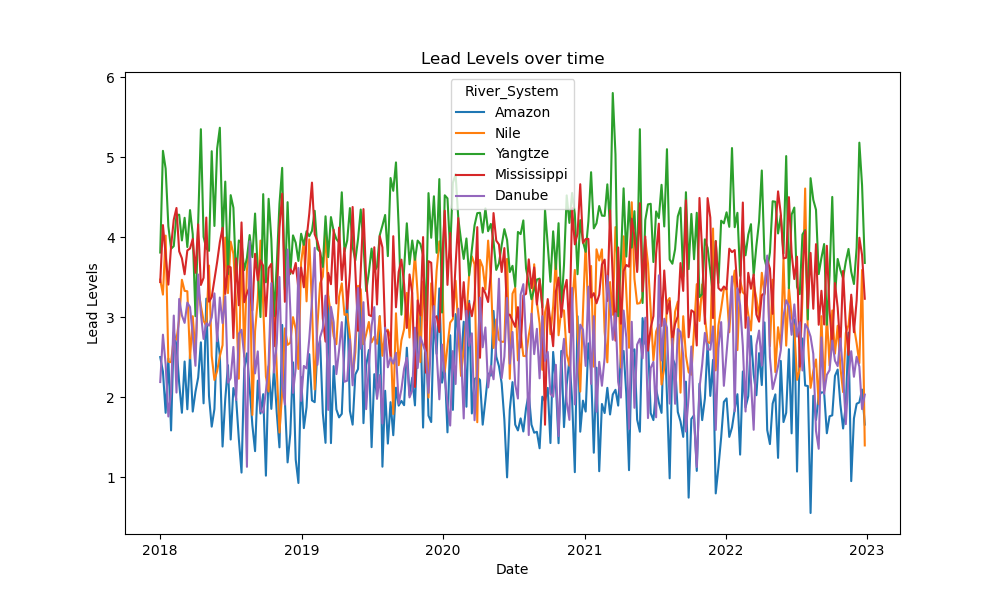
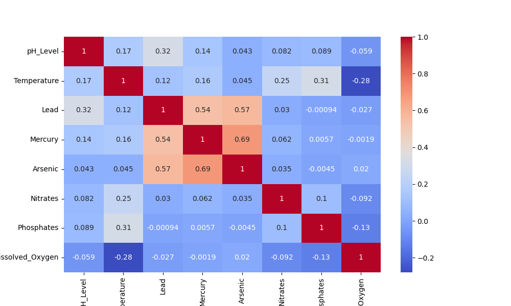

# Environmental Toxin Analysis in River Systems Project

EcoGuard, a non-profit organization dedicated to protecting water resources. The organization is concerned about the increasing levels of toxins in major river systems across the country.

The task will be to perform an exploratory data analysis on the river toxin data to uncover insights that can drive conservation efforts and policy recommendations.

[Notebook Link](https://github.com/Kurodataio/Environmental_Toxin_Analysis_in_River_Systems.ipynb)  

---

## Table of Contents

- [Overview](#overview)  
- [Dataset](#dataset)  
- [Technologies Used](#technologies-used)  
- [Installation](#installation)  
- [Usage](#usage)  
- [Analysis & Visualizations](#analysis--visualizations)  
- [Conclusion](#conclusion)  
- [Credits](#credits)  
- [License](#license)  

---

## Overview

- Perform an exploratory data analysis of EcoGuard's river toxin data
- The data will be imported, cleaned and basic analysis performed
- Visualizations will also be added to aid further analysis and insights

---

## Dataset

- The dataset is sourced from ITOnlinelearning/Kaggle
- The dataset has 1305 rows and 10 columns/features
- The dataset covers the period 2018 - 2023
- The Key features/columns used are various toxin levels, pH levels, temperature, and geographical data
- The data set was checked for missing values and appropiate type. A basic analysis was also performed.

Dataset: National_River_Toxin_Dataset 1.csv

---

<h2>Technologies Used</h2>

<ul>
  <li><strong>Languages & Libraries:</strong> Python, Pandas, NumPy, Matplotlib, Scipy, sklearn</li>
  <li><strong>Tools:</strong> Jupyter Notebook, VS Code, Git, GitHub</li>
</ul>

<p>
  
  
  
  
  
  

</p>
<!-- <p align="left"> -->
<P>
  
    
  
  
</p>
<p>
  
</p>

---

## Installation

Step-by-step instructions to set up the project locally:

```bash

# Clone the repository
git clone https://github.com/Kurodataio/River-Toxin-Analysis.git

# Navigate to the project folder
cd River-Toxin-Analysis

# Launch Jupyter Notebook
jupyter notebook


```

## Usage

Instructions for using the project:

1. Open the main notebook (`Environmental_Toxin_Analysis_in_River_Systems.ipynb`)  
2. Run each cell sequentially to reproduce the analysis  
3. Visualizations and results will be generated automatically  

---

## Analysis & Visualizations 

- There were many missing values across many features. We decided to use the average feature value to replace missing values
- The Yangtze has the highest toxins of heavy metals (Lead, Nercury and Arsenic)
- The Amazon has the lowest toxins of heavy metals (Lead, Nercury and Arsenic)
 

The plot of Lead Levels over time also depicts Yangtze river as most polluted with Lead.
 

- There is correlation between Lead, Arsenic and Mercury toxins in the river system. These heavy metals pose the highest risk to human health
- The heatmap indicates a negative correlation of temperature to dissolved oxygen. In other words higher temprature indicate lower dissolved oxygen.
 

- Linear Regression analysis for toxin levels and pH
  - Linear Regression Coefficients: [0.80294889]
  - Linear Regression Intercept: -2.89324669492776
  - pH=0.8029×Toxin Level−2.8932
- The value of 0.80 suggests a strong positive relationship between pH levels and toxin levels

---

## Conclusion 

- The data suggests a strong correlation between industrialization and river toxin levels. The Amazon which we assume is the least industralized area, has the lowest heavy metal contaminants
- Heavy metals tend to be a byproduct of industrial discharge and mining runoff
- Lower pH (more acidic water) seems linked to increase Lead levels, higher lead levels is correlated with other heavy metals.
- The Nile is the mean for river polution. The t-test between the Amazon and Nile river comparison suggest a significant difference in polution levels which is not due to noise or chance.

---

## Credits

- **Tutorials / References:** ITOnlinelearning.com 
- **Dataset Source:** ITOnlinelearning.com

---

## License

This project is licensed under the [MIT License](https://choosealicense.com/licenses/mit/). EcoGuard is a fictional commpany.

---

